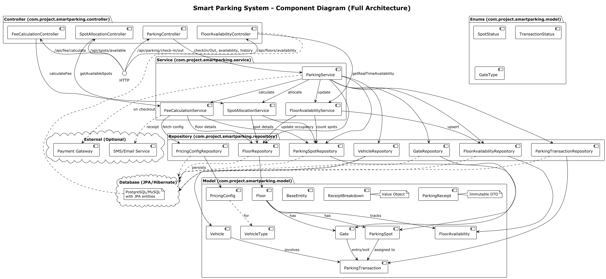

Smart Parking System 🚗
A Java-based Smart Parking System using Spring Boot, JPA, and design principles for efficient garage management. The system handles vehicle check-in/out, spot allocation, dynamic fee calculation, and real-time availability tracking to optimize parking operations.
🏗️ Architecture Overview
This Spring Boot application features a layered architecture with entities for data modeling, repositories for persistence, services for business logic, and REST controllers for API exposure. It supports multi-floor garages, vehicle types (e.g., car, truck), and pricing tiers (e.g., peak hours, long-term discounts).

Failed to load imageView link
The class diagram illustrates the relationships between key components:
Entities & DTOs: BaseEntity (abstract base with timestamps), Floor, ParkingSpot, Vehicle, Gate, ParkingTransaction, PricingConfig, FloorAvailability, ParkingReceipt (immutable DTO for receipts), and ReceiptBreakdown (value object for fee details) represent core data.
Enums: VehicleType (e.g., CAR, TRUCK), SpotStatus (e.g., AVAILABLE, OCCUPIED), TransactionStatus (e.g., ACTIVE, COMPLETED), and GateType (ENTRY, EXIT) define types and states.
Repositories: FloorRepository, ParkingSpotRepository (with locking for allocation), VehicleRepository, ParkingTransactionRepository, GateRepository, PricingConfigRepository, and FloorAvailabilityRepository (JPA interfaces with custom queries) handle data access via Hibernate.
Services: SpotAllocationService (hierarchical spot finding), FeeCalculationService (dynamic pricing with surcharges), ParkingService (check-in/out flows with concurrency locks), and FloorAvailabilityService (scheduled real-time updates) encapsulate business logic.
Controllers: FeeCalculationController, SpotAllocationController, ParkingController (core flows), and FloorAvailabilityController manage REST interactions.
Relationships: Includes composition (e.g., Floor to ParkingSpot via one-to-many), association (e.g., ParkingTransaction to Vehicle and Gate), and dependency (e.g., services to repositories). Facade-like delegation via services unifies operations.
✨ Features

Spot Allocation: Intelligent assignment preferring entry floor, then any floor, with upgrades to larger spots (e.g., motorcycle in car spot). Supports pessimistic locking for concurrency.
Dynamic Fee Calculation: Tiered pricing (hourly/daily/weekly/monthly) with surcharges for peak hours/weekends and long-term discounts. Generates detailed breakdowns and receipts.
Vehicle Check-in/Out: Secure flows with per-vehicle locks, gate validation, and status updates. Tracks duration, computes fees, and frees spots on exit.
Multi-Floor & Real-Time Availability: Per-floor/type tracking with scheduled updates (every 30s). Exposes nested API responses for UI dashboards.
Vehicle History & Reporting: Retrieve parking history by license plate, total parked vehicles, and daily revenue queries.
Reservation-Ready Extensibility: Spot status includes RESERVED; easy to add Observer for notifications (e.g., spot available alerts).

🚀 Getting Started
Prerequisites

Java 17+
Maven/Gradle
PostgreSQL/MySQL (or H2 for dev)

Setup

Clone the repo: git clone <repo-url>
Configure application.yml with DB credentials.
Run migrations (Flyway/Liquibase) or use JPA auto-DDL.
Start: mvn spring-boot:run

API Endpoints

Check-in: POST /api/parking/check-in?licensePlate=ABC123&vehicleType=CAR&entryGateId=1
Fee Estimate: POST /api/fee/calculate?vehicleType=CAR&checkIn=2025-10-25T09:00&checkOut=2025-10-25T11:00
Availability: GET /api/parking/availability
History: GET /api/parking/history/{licensePlate}

🛠️ Tech Stack

Backend: Spring Boot, JPA/Hibernate, Spring Data
Persistence: PostgreSQL (with indexes for performance)
Patterns: Strategy (pricing strategies), Observer (extensible notifications), Factory (repo instantiation via Spring)
Testing: JUnit, MockMvc for controllers; @DataJpaTest for repos
Deployment: Docker-ready; scalable with K8s

📈 Future Enhancements

Integrate payment gateways (e.g., Stripe) on checkout.
Add WebSocket for live availability pushes.
ML-based recommendations (e.g., preferred spots via history).

For contributions or issues, see CONTRIBUTING.md. Licensed under MIT.